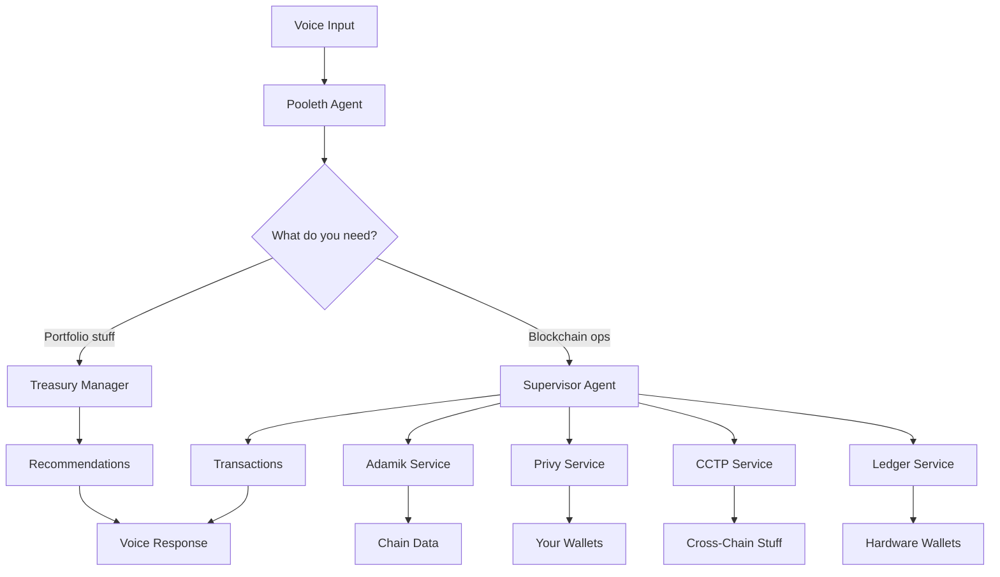

# Pooleth – Your Egg-celent Crypto Nest Manager 🐣


**ETH Global Cannes 2025 Hackathon Project**

Meet Pooleth, your AI-powered crypto CFO and personal mother hen for DeFi. Basically, we got tired of manually checking balances across different chains and losing track of yield opportunities, so we built a voice assistant that does the heavy lifting. Talk to it like you're talking to a friend, and it'll help you manage your portfolio without the usual DeFi headaches.

## What We Built

**Voice-First Interface** - Talk to your portfolio instead of clicking through 10 different apps  
**Secure Embedded Wallets** - Privy-powered authentication with wallet support  
**Multi-Chain Treasury** - One wallet works across 10+ EVM chains (because who has time for bridging addresses?)  
**Smart Portfolio Analysis** - AI suggestions for better yields and security  
**Cross-Chain Bridging** - Circle's CCTP for moving USDC around  
**Hardware Wallet Security** - Send funds to your Ledger when you're feeling paranoid

## How It All Works

### The Agent Setup

- **Pooleth Agent**: The main voice interface (loves egg puns, sorry not sorry)
- **Supervisor Agent**: Does all the actual blockchain stuff
- **Treasury Manager**: Figures out where you should put your money

### Core Services (`src/app/services/`)

- **`privy.ts`** - Handles wallets and transactions
- **`adamik.ts`** - Gets blockchain data from everywhere
- **`cctp.ts`** - Circle's cross-chain USDC transfers (pretty neat actually)
- **`ledger.ts`** - Hardware wallet integration (for the security-conscious folks)

### Architecture Flow



## Getting Started

### 1. Set up your environment

Copy `.env.example` to `.env.local` and fill these out:

```bash
# OpenAI (for the voice stuff)
OPENAI_API_KEY=your_openai_api_key

# Privy (for wallets)
NEXT_PUBLIC_PRIVY_APP_ID=your_privy_app_id
PRIVY_APP_ID=your_privy_app_id
PRIVY_APP_SECRET=your_privy_app_secret

# Adamik (for blockchain data)
ADAMIK_API_KEY=your_adamik_api_key
ADAMIK_BASE_URL=https://api.adamik.io
```

### 2. Run it

```bash
pnpm install
pnpm dev
```

### 3. Try it out

1. Go to `http://localhost:3000`
2. Sign in with whatever (email/Google/Twitter)
3. Hit "Connect" and start talking
4. Try: _"Analyze my portfolio across Ethereum, Base, and Arbitrum"_

## What You Can Say

**Portfolio stuff:**

- _"Analyze my portfolio"_ - See what you've got and where
- _"Optimize my assets"_ - Get suggestions for better returns
- _"Secure my high-value assets"_ - Move big amounts to hardware wallet

**Cross-chain operations:**

- _"Bridge 100 USDC from Ethereum to Base"_ - Move tokens around
- _"Check yields on Arbitrum"_ - Compare rates across chains
- _"Send tokens to my Ledger"_ - Cold storage time

**Basic queries:**

- _"What's my balance on Polygon?"_ - Check balances anywhere
- _"Show my transaction history"_ - See what you've been up to
- _"Create a new wallet"_ - Spin up a new EVM wallet

## Tech Stack

- **Frontend**: Next.js 15, React 18, TypeScript, Tailwind
- **Voice**: OpenAI Realtime API
- **Wallets**: Privy + Ledger integration
- **Blockchain**: Adamik API (supports way too many chains)
- **Cross-Chain**: Circle's CCTP
- **Deployment**: Vercel

## Cool Stuff You Can Demo

1. **Voice Portfolio Analysis** - Just ask about your holdings across chains
2. **USDC Bridging** - Move money between networks without the usual pain
3. **Hardware Wallet Integration** - Send to Ledger with voice commands
4. **Multi-Chain Management** - One address works everywhere (EVM only though)
5. **Yield Recommendations** - AI suggests where to put your money

## Known Issues & Limitations

- Only works with EVM chains (no Solana/Cosmos/etc yet)
- Voice recognition can be wonky sometimes
- Yield data is mostly mocked for demo purposes
- Ledger integration requires Chrome/Edge (WebHID stuff)
- CCTP only works for USDC (that's all Circle supports anyway)

---

**Built with ❤️ (and lots of coffee) for ETH Global Cannes 2025**

_Ready to grow your crypto nest egg? Let Pooleth be your egg-spert guide!_ 🐣
