# Adamik Agent

A sophisticated voice-enabled blockchain assistant powered by OpenAI's Realtime API and Privy authentication. Built with Next.js, this application provides seamless voice interactions for blockchain operations with secure embedded wallet management.

## ✨ Features

### 🎯 Core Functionality

- **Voice-First Interface**: Natural speech recognition and AI-powered responses
- **Blockchain Integration**: Direct interaction with blockchain networks via Adamik API
- **Secure Authentication**: Privy-powered login with embedded wallet creation
- **Real-time Communication**: WebRTC-based low-latency audio streaming
- **Multi-Agent Support**: Configurable AI agents for different blockchain scenarios

### 🎨 Modern UI/UX

- **Professional Design**: Clean, modern interface with thoughtful visual hierarchy
- **Responsive Layout**: Optimized for desktop and mobile experiences
- **Enhanced Chat Interface**: Modern message bubbles with markdown support
- **Real-time Logs**: Comprehensive event logging with beautiful UI
- **Smooth Animations**: Micro-interactions and transitions for better UX
- **Accessibility**: Focus management and keyboard navigation support

### 🔐 Security & Wallet Management

- **Embedded Wallets**: Secure, user-specific wallet creation and management
- **Multi-User Support**: Individual user sessions with personal wallet access
- **Authentication Guards**: Protected routes ensuring secure access
- **Wallet Integration**: Seamless blockchain transaction signing

## 🏗️ Architecture

### System Overview

This application is **not** an MCP (Model Context Protocol) server, but rather a **blockchain agent system** that uses Privy as its secure wallet backend. The Adamik agent provides blockchain intelligence and operations, while Privy handles the cryptographic infrastructure.

### Architecture Flow

```mermaid
graph TD
    A["User Voice Input"] --> B["OpenAI Realtime API"]
    B --> C["Adamik Agent Config"]
    C --> D{"Tool Required?"}

    D -->|No| E["Direct AI Response"]
    D -->|Yes| F["Tool Execution"]

    F --> G["makeWalletRequest"]
    F --> H["makeProxyRequest"]

    G --> I["API: wallet route"]
    H --> J["API: adamik route"]

    I --> K["Privy Service"]
    J --> L["Adamik API"]

    K --> M["Privy Infrastructure"]
    L --> N["Blockchain Networks"]

    M --> O["Embedded Wallet Operations:<br/>• Key Management<br/>• Transaction Signing<br/>• Address Derivation"]

    N --> P["Blockchain Operations:<br/>• Balance Queries<br/>• Transaction Broadcasting<br/>• Chain Validation"]

    O --> Q["Response Data"]
    P --> Q

    Q --> R["Tool Result"]
    R --> S["Agent Processing"]
    S --> T["AI Response Generation"]
    T --> U["Voice Output to User"]

    subgraph "Agent Layer"
        C
        F
    end

    subgraph "API Layer"
        G
        H
        I
        J
    end

    subgraph "Service Layer"
        K
        L
    end

    subgraph "Infrastructure Layer"
        M
        N
    end

    style A fill:#e1f5fe
    style U fill:#e8f5e8
    style C fill:#fff3e0
    style K fill:#f3e5f5
    style M fill:#fce4ec
```



### Component Architecture

#### 1. Agent Layer

**Adamik Agent Configuration** (`src/app/agentConfigs/adamik/`)

- **Purpose**: Defines the blockchain assistant's personality, capabilities, and available tools
- **Key Files**:
  - `index.ts`: Main agent configuration with instructions and tool definitions
  - `chains.ts`: Supported blockchain networks
  - `schemas.ts`: TypeScript schemas for API interactions
  - `supervisorAgent.ts`: Agent oversight and routing logic

#### 2. API Layer

**Request Routing** (`src/app/lib/api.ts`)

- **`makeWalletRequest()`**: Routes wallet operations to Privy service
- **`makeProxyRequest()`**: Routes blockchain queries to Adamik API
- **Purpose**: Abstracts service calls and handles user context

**API Endpoints**:

- **`/api/wallet`**: Wallet operations (keys, signing, addresses)
- **`/api/adamik`**: Blockchain data and transaction encoding

#### 3. Service Layer

**Privy Service** (`src/app/services/privy.ts`)

- **Wallet Management**: Create and manage embedded wallets
- **Key Operations**: Extract public keys for multi-chain address derivation
- **Transaction Signing**: Raw hash signing for any blockchain
- **User Context**: Secure, user-specific wallet operations

**Adamik API Integration**

- **Chain Operations**: Balance queries, transaction history, validator lists
- **Transaction Encoding**: Convert transaction intents to signable format
- **Broadcasting**: Submit signed transactions to blockchain networks

#### 4. Infrastructure Layer

**Privy Infrastructure**

- **Embedded Wallets**: Secure key storage and management
- **Authentication**: User login and session management
- **Cryptographic Operations**: Private key operations and signatures

**Blockchain Networks**

- **Multi-Chain Support**: Ethereum, Polygon, Solana, and more
- **Real-Time Data**: Live blockchain state and transaction status
- **Transaction Processing**: Mempool submission and confirmation tracking

### Authentication Flow

```
User Login → Privy Authentication → Embedded Wallet Creation → Agent Connection
```

### Agent-Privy Connection

The connection between the Adamik agent and Privy service works as follows:

1. **Agent Tools**: Defined in agent config (e.g., `getPubKey`, `getAddress`, `signTransaction`)
2. **API Routing**: Tools call `makeWalletRequest()` with user context
3. **Wallet Endpoint**: `/api/wallet` receives requests and routes to Privy service
4. **Privy Operations**: Service performs secure wallet operations
5. **Response Chain**: Results flow back through the layers to the agent

**Example Flow**:

```typescript
// 1. Agent tool execution
getPubKey: async (args, transcript, breadcrumb, userContext) => {
  const pubKey = await makeWalletRequest("getPubKey", {}, userContext);
  return { content: [{ type: "text", text: JSON.stringify(pubKey) }] };
}

// 2. API routing
export async function makeWalletRequest(action, params, userContext) {
  const response = await fetch("/api/wallet", {
    method: "POST",
    body: JSON.stringify({ action, userId: userContext?.userId, ...params })
  });
  return await response.json();
}

// 3. Wallet endpoint processing
case "getPubKey":
  const wallet = await privyService.getWallet(userId, { walletAddress, chainType });
  const publicKey = await privyService.getPublicKey(wallet.id);
  return NextResponse.json({ publicKey, walletId: wallet.id });
```

### Agent System

- **Configurable Agents**: Multiple agent personalities and capabilities
- **Tool Integration**: Blockchain-specific functions with user context
- **Real-time Processing**: Live audio processing with WebRTC
- **Event Logging**: Comprehensive client/server event tracking

### Tech Stack

- **Frontend**: Next.js 15, React 18, TypeScript
- **Styling**: Tailwind CSS with custom design system
- **Authentication**: Privy (email, Google, Twitter)
- **Audio**: OpenAI Realtime API with WebRTC
- **Blockchain API**: Adamik API for multi-chain operations
- **Wallet Backend**: Privy embedded wallets for secure key management
- **Agent System**: Custom blockchain agent configuration (not MCP server)
- **Deployment**: Vercel-ready configuration

## 🚀 Getting Started

### Prerequisites

- Node.js 18+ and npm/pnpm
- Privy account and application setup
- OpenAI API access with Realtime API enabled
- Adamik API credentials

### Environment Setup

Create a `.env.local` file with:

```bash
# OpenAI Configuration
OPENAI_API_KEY=your_openai_api_key

# Privy Configuration (Client-side)
NEXT_PUBLIC_PRIVY_APP_ID=your_privy_app_id

# Privy Configuration (Server-side)
PRIVY_APP_ID=your_privy_app_id
PRIVY_APP_SECRET=your_privy_app_secret

# Adamik API Configuration
ADAMIK_API_KEY=your_adamik_api_key
ADAMIK_BASE_URL=https://api.adamik.io
```

### Installation & Development

```bash
# Install dependencies
npm install

# Start development server
npm run dev

# Build for production
npm run build

# Start production server
npm start
```

### Privy Dashboard Configuration

1. **Allowed Origins**: Add your domain(s):
   - `http://localhost:3000` (development)
   - `https://yourdomain.com` (production)
2. **Login Methods**: Enable email, Google, Twitter as needed
3. **Embedded Wallets**: Ensure embedded wallets are enabled

## 🎮 Usage

### Getting Started

1. **Sign In**: Use email, Google, or Twitter authentication
2. **Wallet Creation**: Embedded wallet automatically created upon login
3. **Agent Selection**: Choose from available blockchain agents
4. **Voice Interaction**: Click "Connect" and start speaking
5. **Blockchain Operations**: Perform transactions via voice commands

### Voice Commands Examples

- "Check my wallet balance"
- "Send 0.1 ETH to [address]"
- "Show my transaction history"
- "What's the current ETH price?"

### Multi-Chain Wallet Management

The system supports creating and managing wallets across multiple blockchain networks:

**Supported Base Chain Types**:

- **Ethereum**: For all EVM-compatible networks (Ethereum, Base, Arbitrum, Polygon, etc.)
- **Solana**: For Solana network operations
- **TRON**: For TRON network operations
- **Cosmos**: For Cosmos SDK-based networks
- **Stellar**: For Stellar network operations

**Automatic Chain Mapping**:
When creating wallets for specific networks, the system automatically maps them to the appropriate base type:

- Networks like `base`, `arbitrum`, `polygon` → `ethereum` base type
- Each user can have one wallet per base type
- EVM wallets work across all EVM-compatible networks with the same address

**Voice Commands for Wallet Management**:

- "Create a new Solana wallet"
- "List all my wallets"
- "Show my Base network address"
- "Create a wallet for TRON"

### Push-to-Talk Mode

- Enable PTT for controlled audio input
- Hold "Talk" button while speaking
- Release to process your request

## 🔧 Configuration

### Agent Configuration

Agents are defined in `src/app/agentConfigs/adamik/`:

- **Instructions**: AI behavior and personality defined in `chatAgentInstructions`
- **Tools**: Available blockchain functions with OpenAI function calling format
- **Tool Logic**: Implementation of each tool with Privy/Adamik integration
- **Chains**: Supported blockchain networks from `chains.ts`

### Agent Configuration Structure

```typescript
const chatAgent: AgentConfig = {
  name: "Adamik",
  publicDescription: "Smart Blockchain Wallet",
  instructions: chatAgentInstructions, // Detailed personality and behavior
  tools: [
    // OpenAI function calling format
    {
      type: "function",
      name: "getPubKey",
      description: "Get the wallet public key",
      parameters: {
        /* schema */
      },
    },
    // ... more tools
  ],
  toolLogic: {
    // Implementation of each tool
    getPubKey: async (args, transcript, breadcrumb, userContext) => {
      const pubKey = await makeWalletRequest("getPubKey", {}, userContext);
      return { content: [{ type: "text", text: JSON.stringify(pubKey) }] };
    },
    // ... more implementations
  },
  downstreamAgents: [], // Supervisor/routing capabilities
};
```

### Available Tools

**Wallet Operations**:

- `getPubKey`: Extract public key for address derivation
- `getAddress`: Get wallet address
- `listWallets`: List all embedded wallets across different blockchains
- `createWallet`: Create new embedded wallets for specific blockchain networks
- `signTransaction`: Sign transaction hashes

**Blockchain Queries**:

- `getSupportedChains`: List available blockchain networks
- `listFeatures`: Get chain capabilities and native currency info
- `getTokenDetails`: Fetch token metadata (decimals, symbol, etc.)
- `getAccountState`: Check balances and staking positions
- `getAccountHistory`: Retrieve transaction history
- `getChainValidators`: List available validators for staking

**Transaction Operations**:

- `encodeTransaction`: Convert transaction intent to signable format
- `broadcastTransaction`: Submit signed transactions to blockchain
- `deriveAddress`: Generate blockchain-specific addresses from public key

### Adding New Agents

1. Create agent folder in `agentConfigs/`
2. Define `index.ts` with agent configuration:

   ```typescript
   import { AgentConfig } from "@/app/types";

   const myAgent: AgentConfig = {
     name: "MyAgent",
     instructions: "Agent personality and behavior...",
     tools: [
       /* tool definitions */
     ],
     toolLogic: {
       /* tool implementations */
     },
   };

   export default [myAgent];
   ```

3. Implement required tools with user context
4. Add to `agentConfigs/index.ts`

### Blockchain Integration

Tools receive user context for secure operations:

```typescript
function myTool(
  args: ToolArgs,
  transcriptItems: any,
  addTranscriptBreadcrumb: any,
  userContext?: { userId: string; walletAddress?: string }
) {
  // Use userContext for user-specific operations
  // Tools can call makeWalletRequest() or makeProxyRequest()
}
```

### Privy Service Configuration

**Environment Variables**:

```bash
# Privy Configuration (Server-side)
PRIVY_APP_ID=your_privy_app_id
PRIVY_APP_SECRET=your_privy_app_secret
```

**Service Capabilities**:

- **User Management**: Get user details and linked accounts
- **Wallet Operations**: List, create, and manage embedded wallets with proper ID handling
- **Multi-Chain Support**: Create wallets for Ethereum, Solana, TRON, Cosmos, and Stellar networks
- **Chain Mapping**: Automatically map EVM-compatible chains (Base, Arbitrum, etc.) to Ethereum base type
- **Key Extraction**: Get public keys for multi-chain address derivation
- **Raw Signing**: Sign transaction hashes for any blockchain
- **Context Handling**: User-specific wallet selection and operations

## 🎨 UI Components

### Design System

- **Colors**: Blue-centric palette with gray accents
- **Typography**: System fonts with proper font features
- **Spacing**: Consistent 4px grid system
- **Shadows**: Layered shadow system for depth
- **Animations**: Smooth micro-interactions

### Key Components

- **Header**: Logo, agent selection, user info
- **Transcript**: Modern chat interface with message bubbles
- **Events**: Real-time logs with expandable details
- **Toolbar**: Connection controls and settings
- **Login**: Stunning authentication screen

### Responsive Design

- **Mobile-First**: Optimized for all screen sizes
- **Touch-Friendly**: Proper touch targets and gestures
- **Adaptive Layout**: Flexible grid system

## 📊 Monitoring & Debugging

### Event Logging

- **Client Events**: User actions and WebRTC status
- **Server Events**: AI responses and API calls
- **Real-time Display**: Live event stream in logs panel
- **Expandable Details**: JSON payload inspection

### Audio Debugging

- **Codec Selection**: Choose optimal audio format
- **Playback Control**: Toggle audio output
- **Recording Download**: Save conversation audio

## 🚀 Deployment

### Vercel Deployment

1. **Environment Variables**: Set all required env vars in Vercel
2. **Domain Configuration**: Update Privy allowed origins
3. **Build Settings**: Use default Next.js build configuration

### Production Considerations

- **HTTPS Required**: Privy and WebRTC need secure contexts
- **Audio Permissions**: Handle browser audio policy
- **Rate Limiting**: Implement OpenAI API rate limiting
- **Error Handling**: Comprehensive error boundaries

## 🤝 Contributing

### Development Guidelines

- **TypeScript**: Strict typing required
- **ESLint**: Follow configured rules
- **Prettier**: Automatic code formatting
- **Components**: Reusable, well-documented components

### Code Structure

```
src/
├── app/
│   ├── agentConfigs/     # Agent definitions & configurations
│   ├── api/              # Next.js API routes
│   ├── components/       # React UI components
│   ├── contexts/         # React context providers
│   ├── hooks/            # Custom React hooks
│   ├── lib/              # Utility functions & helpers
│   ├── services/         # Third-party service integrations
│   │   └── privy.ts      # Privy wallet service
│   └── types.ts          # TypeScript type definitions
```

## 📝 License

This project is licensed under the MIT License - see the [LICENSE](LICENSE) file for details.

## 🆘 Support

For issues and questions:

1. Check existing [GitHub Issues](../../issues)
2. Review [Privy Documentation](https://docs.privy.io)
3. Consult [OpenAI Realtime API Docs](https://platform.openai.com/docs)
4. Check [Adamik API Documentation](https://docs.adamik.io)

---

**Built with ❤️ for the blockchain community**
