# Pooleth – Your Egg-celent Crypto Nest Manager 🐣

**ETH Global Cannes 2025 Hackathon Project**

Meet Pooleth, your AI-powered crypto CFO and personal mother hen for DeFi. Pooleth keeps your crypto nest egg safe, warm, and ready to hatch profits by analyzing yield opportunities, balancing risk, and delivering egg-spert strategies to make your treasury management simple, smart, and just a little bit silly.

## ✨ What Makes Pooleth Special

🎙️ **Voice-First Interface** - Natural speech recognition with OpenAI's Realtime API  
🔐 **Secure Embedded Wallets** - Privy-powered authentication with hardware wallet support  
🌐 **Multi-Chain Treasury** - Unified EVM wallet works across 40+ chains  
💰 **Smart Portfolio Analysis** - AI-powered yield optimization and risk assessment  
🌉 **Cross-Chain Bridging** - Circle's CCTP integration for seamless USDC transfers  
🔒 **Hardware Wallet Security** - Ledger integration for cold storage

## 🏗️ Project Architecture

### Agent System

- **🎙️ Main Agent**: Voice interface with egg-themed personality
- **🧠 Supervisor Agent**: All blockchain operations and validation
- **💰 Treasury Manager**: Portfolio optimization and yield strategies

### Core Services (`src/app/services/`)

- **`privy.ts`** - Embedded wallet management and EVM transactions
- **`adamik.ts`** - Blockchain data and multi-chain operations
- **`cctp.ts`** - Circle's Cross-Chain Transfer Protocol for USDC bridging
- **`ledger.ts`** - Hardware wallet integration for secure cold storage

### How Everything Connects

```mermaid
graph TD
    A[🎤 Voice Input] --> B[🐣 Pooleth Agent]
    B --> C{Request Type}

    C -->|Portfolio Analysis| D[💰 Treasury Manager]
    C -->|Blockchain Operations| E[🧠 Supervisor Agent]

    E --> F[🌐 Adamik Service]
    E --> G[🔐 Privy Service]
    E --> H[🌉 CCTP Service]
    E --> I[🔒 Ledger Service]

    F --> J[Multi-Chain Data]
    G --> K[Embedded Wallets]
    H --> L[Cross-Chain Bridges]
    I --> M[Hardware Wallets]

    D --> N[🎯 Strategic Recommendations]
    E --> O[⚡ Transaction Execution]

    N --> P[🔊 Voice Response]
    O --> P
```



## 🚀 Quick Start

### 1. Environment Setup

Copy `.env.example` to `.env.local` and fill in your API keys:

```bash
# OpenAI Configuration
OPENAI_API_KEY=your_openai_api_key

# Privy Configuration
NEXT_PUBLIC_PRIVY_APP_ID=your_privy_app_id
PRIVY_APP_ID=your_privy_app_id
PRIVY_APP_SECRET=your_privy_app_secret

# Adamik API Configuration
ADAMIK_API_KEY=your_adamik_api_key
ADAMIK_BASE_URL=https://api.adamik.io
```

### 2. Installation & Launch

```bash
# Install dependencies
pnpm install

# Start development server
pnpm dev
```

### 3. Ready to Hatch! 🐣

1. Open `http://localhost:3000`
2. Sign in with Privy (email/Google/Twitter)
3. Click "Connect" and start chatting with Pooleth
4. Try: _"Analyze my portfolio across Ethereum, Base, and Arbitrum"_

## 🎮 Voice Commands

**Portfolio Management**

- _"Analyze my portfolio"_ - Cross-chain yield and security analysis
- _"Optimize my assets"_ - Strategic recommendations for better returns
- _"Secure my high-value assets"_ - Hardware wallet transfers for security

**Cross-Chain Operations**

- _"Bridge 100 USDC from Ethereum to Base"_ - CCTP cross-chain transfers
- _"Check yields on Arbitrum"_ - Compare DeFi opportunities across chains
- _"Send tokens to my Ledger"_ - Hardware wallet cold storage

**Multi-Chain Queries**

- _"What's my balance on Polygon?"_ - Real-time balance checks
- _"Show my transaction history"_ - Multi-chain transaction tracking
- _"Create a new wallet"_ - EVM wallet creation across all chains

## 🔧 Tech Stack

- **Frontend**: Next.js 15, React 18, TypeScript, Tailwind CSS
- **Voice**: OpenAI Realtime API with WebRTC
- **Wallets**: Privy embedded wallets + Ledger hardware integration
- **Blockchain**: Adamik API for 40+ EVM chains
- **Cross-Chain**: Circle's CCTP for USDC bridging
- **Deployment**: Vercel-ready

## 🌟 Key Features Demo

1. **Voice-Activated Portfolio Analysis** - "Analyze my crypto across all chains"
2. **Cross-Chain USDC Bridging** - Seamless transfers via Circle's CCTP
3. **Hardware Wallet Security** - One-click Ledger transfers for large amounts
4. **Multi-Chain Treasury Management** - Unified wallet across 40+ EVM chains
5. **AI-Powered Yield Optimization** - Smart recommendations for DeFi strategies

---

**Built with ❤️ for ETH Global Cannes 2025**

_Ready to grow your crypto nest egg? Let Pooleth be your egg-spert guide!_ 🐣💰
